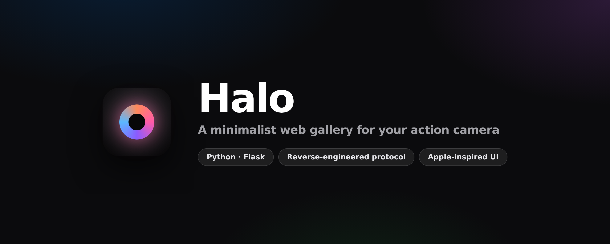
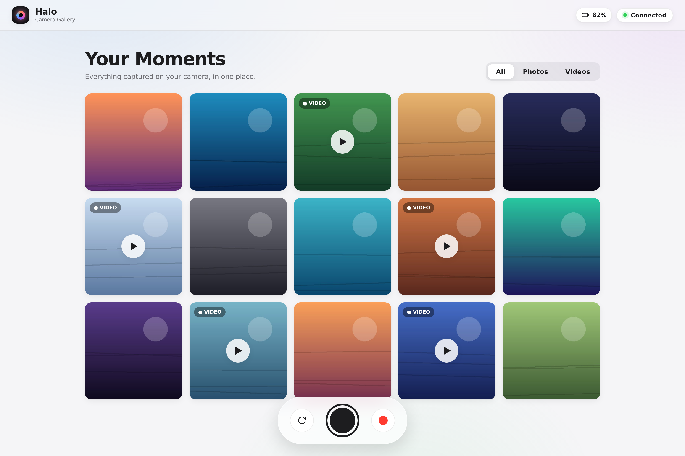
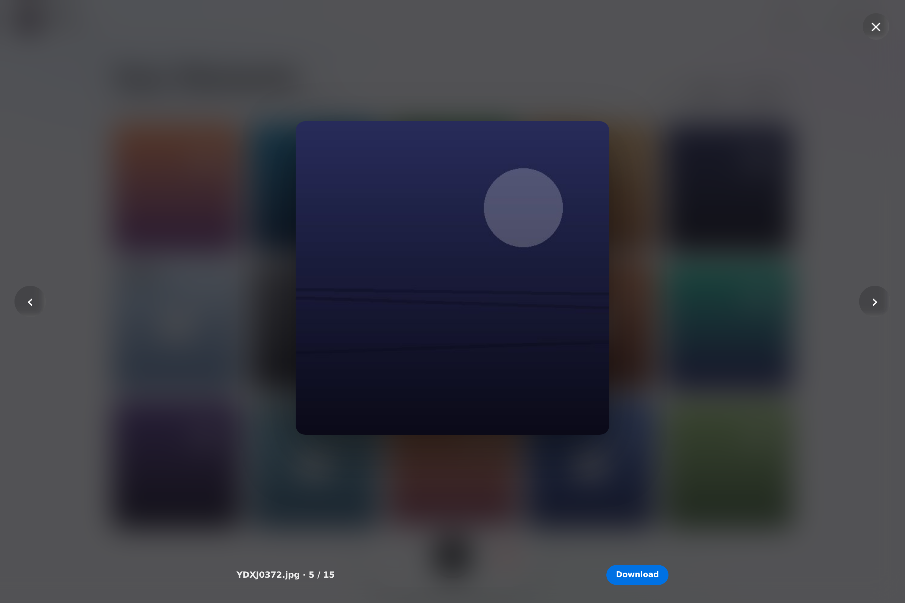
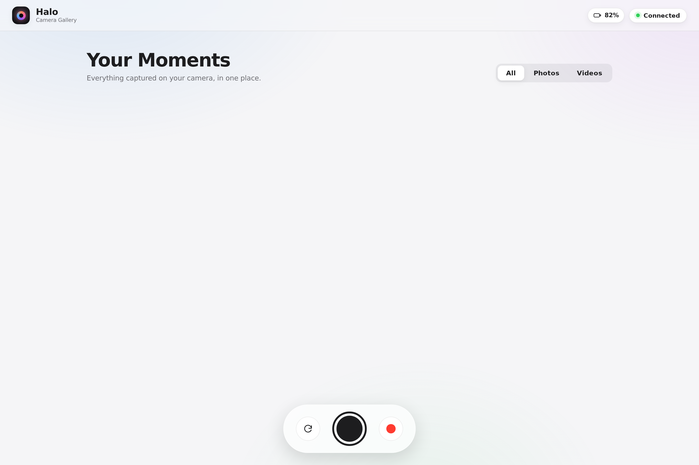
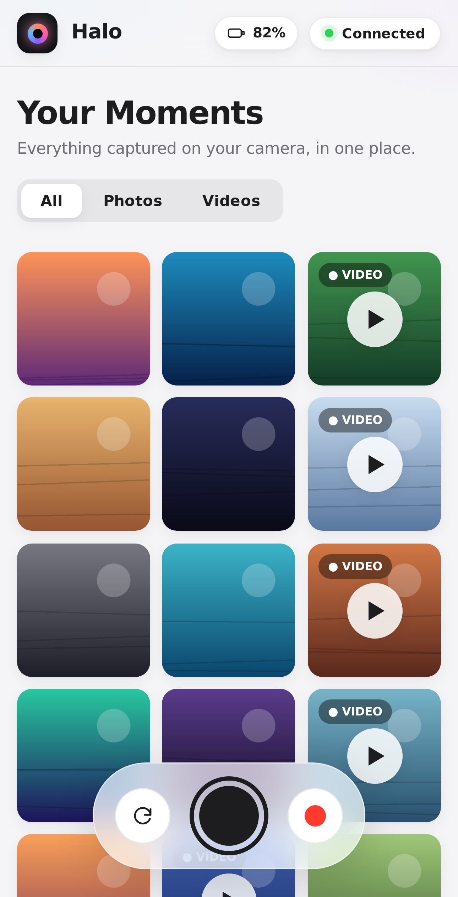

<p align="center">
  
</p>

<p align="center">
  <strong>A minimalist, Apple-inspired web app that turns an original Xiaomi YI Action Camera into a modern, browsable gallery — with capture and record — straight from your browser.</strong>
</p>

<p align="center">
  
  
  
  
  
</p>

---

## 📖 Overview

The original Xiaomi YI Action Camera has **no screen** and its companion mobile app is **discontinued** — so once you have footage on the camera, there's no clean way to browse it from a laptop.

**Halo fixes that.** It speaks the camera's undocumented control protocol to trigger photo/video capture, reads media off the device over its built-in HTTP server, and presents everything in a polished, responsive gallery that feels like a first-party Apple app.

> 💡 **The interesting part:** Halo is built on a **reverse-engineered TCP/JSON protocol**. Getting here meant packet-level debugging, reading community protocol dumps, and making a hard engineering call when the camera's firmware turned out to have a broken video-streaming stack (see [The Engineering Story](#-the-engineering-story)).

---

## ✨ Features

| | Feature | Description |
|---|---|---|
| 🖼️ | **Unified gallery** | Every photo & video on the SD card in a responsive grid with smooth hover motion and lazy loading |
| 🎞️ | **Smart filters** | Segmented **All / Photos / Videos** control, iOS-style |
| 🔍 | **Immersive lightbox** | Full-screen viewer with blur backdrop, keyboard navigation (`← →`, `Esc`), and one-tap download |
| 📸 | **Remote capture** | Trigger a photo from the browser with a tactile shutter animation |
| ⏺️ | **Remote record** | Start/stop video with a live recording timer |
| 🔋 | **Live device status** | Real-time connection indicator + battery level, auto-polled |
| 📱 | **Fully responsive** | Fluid layout from desktop down to a 3-column mobile grid |

---

## 📸 Screenshots

### Gallery


### Immersive lightbox


### Recording state &nbsp;·&nbsp; Empty state
<p>
  
  
</p>

### Mobile
<p align="center">
  
</p>

---

## 🏗️ Architecture

```
┌──────────────┐        HTTP/JSON        ┌─────────────────────┐
│   Browser    │  ◄──────────────────►   │   Flask backend     │
│  (Halo UI)   │      /api/* routes      │      (app.py)       │
└──────────────┘                         └──────────┬──────────┘
                                                    │
                          ┌─────────────────────────┼─────────────────────────┐
                          │                          │                         │
                   TCP :7878 JSON              HTTP :80 files            (proxy /media)
                   token handshake             /DCIM/ listing            range requests
                          │                          │                         │
                          ▼                          ▼                         ▼
                 ┌───────────────────────────────────────────────────────────────┐
                 │           Xiaomi YI Action Camera  (YDXJ_v25L)                 │
                 │   control socket • settings • capture/record • file server     │
                 └───────────────────────────────────────────────────────────────┘
```

- **`yi_camera.py`** — a clean, reusable client for the camera's TCP/JSON protocol. Handles the token handshake, a streaming JSON parser (the camera interleaves async status frames with command replies), and typed commands for capture, record, battery, and settings.
- **`app.py`** — a thin Flask layer exposing a REST API and **proxying media** through the server (with HTTP `Range` support so video scrubbing works in the browser).
- **`static/` + `templates/`** — a dependency-free frontend (vanilla JS + a hand-built CSS design system). No build step, no framework.

---

## 🧠 The Engineering Story

This project is a case study in **debugging the unknown and making pragmatic decisions**:

1. **Reverse-engineered the protocol.** With no official docs, I identified the camera's TCP/JSON control channel (port `7878`), the mandatory token handshake, and the message IDs for capture (`769`), record (`513/514`), and status (`13`).
2. **Hit a firmware wall.** The goal was live video for on-device object detection. The camera *activated* its RTSP stream (`rval:0`) but never delivered frames. Systematic testing — multiple stream URLs, **both UDP and TCP transports**, OpenCV, FFmpeg CLI, and VLC — isolated a **`461 Unsupported Transport`** at the RTSP layer.
3. **Diagnosed the root cause.** Cross-referencing community reports confirmed a **defect in this specific firmware's RTSP server** (`v1.5.12`): the stream is reachable but unusable by any standard PC client. Not a code bug — a hardware/firmware limitation.
4. **Made the pragmatic call.** Rather than sink time into an unfixable stream, I **pivoted the product** to maximize what the hardware does reliably — gallery, capture, and record — and invested in an exceptional UX instead. **Halo** is the result.

> This mirrors real product engineering: validate assumptions early, isolate variables methodically, and ship value around real-world constraints.

---

## 🚀 Getting Started

### Prerequisites
- An original **Xiaomi YI Action Camera** with a microSD card
- **Python 3.9+**

### Install & run
```bash
git clone https://github.com/<your-username>/halo.git
cd halo
pip install -r requirements.txt

# Connect your laptop to the camera's Wi-Fi:
#   SSID:      YDXJ_xxxxxxx
#   Password:  1234567890

python app.py        # -> http://127.0.0.1:5000
```

Override the camera IP if needed:
```bash
YI_IP=192.168.42.1 python app.py
```

---

## 🛠️ Tech Stack

| Layer | Technology |
|---|---|
| **Backend** | Python, Flask |
| **Camera I/O** | Raw TCP sockets, custom JSON protocol client, HTTP streaming proxy |
| **Frontend** | Vanilla JavaScript (zero dependencies), hand-crafted CSS design system |
| **Design** | Glassmorphism, `cubic-bezier` motion, Inter type, responsive grid |

---

## 📂 Project Structure

```
halo/
├── app.py              # Flask backend: REST API + media proxy
├── yi_camera.py        # Reusable camera protocol client (TCP :7878)
├── templates/
│   └── index.html      # App shell
├── static/
│   ├── style.css       # Apple-inspired design system
│   └── app.js          # Gallery, filters, lightbox, capture/record
├── docs/               # Screenshots & banner
├── requirements.txt
└── README.md
```
# ⚡ Halo Performance: Pagination & Caching

The original Xiaomi YI has a **tiny embedded HTTP server**. Loading a whole
gallery at once fires dozens of simultaneous image requests at it, which it
serializes and chokes on. This build fixes that with four layers.

## 1. Pagination (server + client)
- `/api/gallery?page=&page_size=` returns only a **slice** of metadata plus
  `total` and `has_more`. No images are fetched during this call, so it's always
  cheap on the camera.
- The UI uses **infinite scroll** (`IntersectionObserver`): the next page loads
  only as you approach the bottom.

## 2. Concurrency cap (protects the camera)
- **Client:** a small task queue limits thumbnail fetches to **3 at a time**.
- **Server:** a `Semaphore(3)` guarantees no more than 3 requests hit the camera
  at once, even across multiple tabs.

## 3. Server-side thumbnail cache (fetch each photo once)
- `/thumb` downscales each photo to ~320 px with **Pillow** and stores it on
  disk (`thumb_cache/`). Every later view is served from disk — the camera is
  **never touched again** for that file.
- Full-resolution images are only pulled when you open the **lightbox**.

## 4. Browser thumbnail cache (IndexedDB)
- Each thumbnail blob is cached in **IndexedDB**, keyed by filename. On reload,
  Halo checks IndexedDB first and only fetches what's missing — so repeat visits
  are **instant and camera-free**.

### Housekeeping
- `POST /api/cache/clear` — wipe the server thumbnail cache.
- `GET  /api/cache/info`  — cache size & file count.
- Tunables via env: `HALO_PAGE_SIZE` (24), `HALO_THUMB_PX` (320),
  `HALO_CACHE_DIR` (cache location).

**Net effect:** the first scroll pulls a few small thumbnails gently, three at a
time; everything after is instant and never re-hits the camera. 🎯

---

## 🗺️ Roadmap

- [ ] Multi-select with bulk download & delete
- [ ] Dark mode
- [ ] On-device **YOLO object detection** on any captured photo
- [ ] PWA / installable offline shell
- [ ] Dockerized deployment

---

## 📄 License

MIT — see [`LICENSE`](LICENSE).

<p align="center"><sub>Built as a study in reverse-engineering, pragmatic product decisions, and interface craft.</sub></p>
